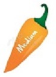
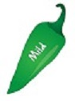

```{r setup, include=FALSE}
library(learnr)
library(tidyverse)
library(gradethis)
library(lubridate)
library(datasauRus)
library(gridExtra)
library(plotly)
library(patchwork)

knitr::opts_chunk$set(echo = FALSE, exercise.checker = gradethis::grade_learnr, fig.align = "center")

surveys <- read_csv("./data/surveys2_subset.csv")
plots <- read_csv("./data/plots.csv")
species <- read_csv("./data/species.csv")

yearly_counts <- surveys %>%
  count(year, species_id) 
yearly_sex_counts <- surveys %>%
  count(year, species_id, sex)
yearly_species_weight <- surveys %>% 
  group_by(year, species_id) %>%
  ## Variables to group by
  summarize(avg_weight = mean(weight))

spp_weight_boxplot <- surveys %>% 
  ggplot(aes(x = genus, y = weight)) +
  geom_violin() +
  geom_jitter(color = "tomato", width = 0.2, alpha = 0.2) +
  scale_y_log10() +
  ## log (base 10) transforms the y-axis variable
  ## (helps to make the plot less skewed)
  labs(x = "", 
       ## removes the y-axis label
       y = expression(Log[10](Weight))) +
       ## Expression creates a mathematical expression in the axis label
       ## the [10] refers to the subscript next to Log
  coord_flip() + 
  theme(axis.text.y = element_text(size = 12), 
        axis.text.x = element_text(size = 12), 
        text = element_text(size = 16))

spp_count_plot <- yearly_counts %>% 
  ggplot(aes(x = year, y = n, color = genus)) +
  geom_line() + 
  labs(x = "Year", 
       y = "Abundance", 
       color = "Genus") +
  theme(axis.title.x = element_text(face = "bold", size = 12))

source("setup-code-chunks.R")
```


## Orientation of/for the Workshop

*  This workshop assumes some basic familiarity with working in `R` such as what you might obtain in the "Introduction to R" workshop or in a statistics course that uses `R` heavily, such as STAT 217 or STAT 411/511. If you have not interacted with `R` previously, some of the assumptions of your background for this workshop might be a barrier. We would recommend getting what you can from this workshop and you can always revisit the materials at a later date after filling in some of those basic `R` skills. We all often revisit materials and discover new and deeper aspects of the content that we were not in a position to appreciate in a first exposure.

*  In order to focus this workshop on coding, we developed this interactive website for you to play in a set of "sandboxes" and try your hand at implementing the methods we are discussing. When each code chunk is ready to run (all can be edited, many have the code prepared for you), you can click on "Run Code". This will run `R` in the background on a server. For the "Challenges", you can get your answer graded although many have multiple "correct" answers, so don't be surprised if our "correct" answer differs from yours. The "Solution" is also provided in some cases so you can see a solution - but you will learn more by trying the challenge first before seeing the answer. Each sandbox functions independently, which means that you can pick up working at any place in the documents and re-set your work without impacting other work (this is VERY different from how `R` usually works!). Hopefully this allows you to focus on the code and what it does... The "Start over" button can be used on any individual sandbox or you can use the one on the left tile will re-set all the code chunks to the original status. 

*  These workshops have been previously taught by Greta Linse and Esther Birch and co-organized by the MSU Library, Statistical Consulting and Research Services (SCRS), and the Department of Mathematical Sciences. More details on us and other workshops are available at the end of the session or via https://www.montana.edu/datascience/training/#workshop-recordings.

Let's get started! 

------------

## Learning Objectives

>
> * Describe the purpose of the **`dplyr`** and **`tidyr`** packages.
> * Select certain columns in a data frame with the **`dplyr`** function `select`.
> * Select certain rows in a data frame according to filtering conditions with the **`dplyr`** function `filter` .
> * Link the output of one **`dplyr`** function to the input of another function with the 'pipe' operator `%>%`.
> * Add new columns to a data frame that are functions of existing columns with `mutate`.
> * Use `summarize`, `group_by`, and `count` to split a data frame into groups of observations, apply summary statistics for each group, and then combine the results.
> * Produce scatter plots, boxplots, density plots, and time series plots using 
>   ggplot2.
> * Set universal and local plot settings.
> * Describe what aesthetics are and how they are used by ggplot().
> * Modify the aesthetics of an existing ggplot() plot (e.g., axis labels, color).


------------

## Data Wrangling using **`dplyr`** & **`tidyr`** Intro

Note that we're not using "data 
manipulation" for this workshop, but are calling it "data wrangling." To us, "data manipulation" is a term that 
captures the event where a researcher manipulates their data (e.g., moving 
columns, deleting rows, merging data files) in a __non-reproducible__ manner. 
Whereas, with data wrangling, all of these process are done, but in a 
__reproducible__ manner, such as using an `R` script!

Packages in `R` are basically sets of additional functions that let you do more
stuff. The functions we've been using so far, like `str()` or `data.frame()`,
come built into `R`; packages give you access to more of them. Before you use a
package for the first time you need to install it on your machine, and then you
should import it in every subsequent `R` session when you need it. You should
already have installed the **`tidyverse`** package. This is an
"umbrella-package" that installs several packages useful for data analysis which
work together well such as **`tidyr`**, **`dplyr`**, **`ggplot2`**, 
**`tibble`**, etc.

The **`tidyverse`** package tries to address 3 common issues that arise when
doing data analysis with some of the functions that come with `R`:

1. The results from a base `R` function sometimes depend on the type of data.
2. Using `R` expressions in a non-standard way, which can be confusing for new
   learners.
3. Hidden arguments, having default operations that new learners are not aware
   of.

We have seen in our previous lesson that when building or importing a data 
frame, the columns that contain characters (i.e., text) are coerced (=converted)
into the `factor` data type. We had to set **`stringsAsFactors`** to **`FALSE`**
to avoid this hidden argument to convert our data type. 

This time we will use the **`tidyverse`** package to read the data and avoid 
having to set **`stringsAsFactors`** to **`FALSE`**

In order to install the `tidyverse` package, you can type `install.packages("tidyverse")` 
straight into the RStudio console. In fact, it's better to write this in the console 
than in a script for any package, as there's no need to re-install packages 
every time we run the script. If you work in a .Rmd (R-markdown) format, any missing packages will be identified and a prompt added to the top of the document about installing the packages. 

Then, to load the package we would need to type:

```r
## load the tidyverse packages -- including dplyr, tidyr, readr, stringr
library(tidyverse)
```

### What are **`dplyr`** and **`tidyr`**?

The package **`dplyr`** is built to work directly with data frames, with many 
common tasks optimized by being written in a compiled language (C++). An 
additional feature is the ability to work directly with data stored in an 
external database. The benefits of doing this are that the data can be managed 
natively in a relational database, queries can be conducted on that database, 
and only the results of the query are returned.

This addresses a common problem with `R` in that all operations are conducted
in-memory and thus the amount of data you can work with is limited by available
memory. The database connections essentially remove that limitation in that you
can connect to a database of many hundreds of GB, conduct queries on it directly,
and pull back into `R` only what you need for analysis.

The package **`tidyr`** addresses the common problem of wanting to reshape your 
data for plotting and use by different `R` functions. Sometimes we want data sets 
where we have one row per measurement. Sometimes we want a data frame where each
measurement type has its own column, and rows are instead more aggregated groups
- like plots or aquaria. Moving back and forth between these formats is 
nontrivial, and **`tidyr`** gives you tools for this and more sophisticated data
wrangling.

To learn more about **`dplyr`** and **`tidyr`** after the workshop, you may want
to check out this
[handy data transformation with **`dplyr`** cheatsheet](https://raw.githubusercontent.com/rstudio/cheatsheets/main/data-transformation.pdf) and this [cheatsheet about **`tidyr`**](https://raw.githubusercontent.com/rstudio/cheatsheets/main/tidyr.pdf).

### Presentation of the Survey Data

The data used in this workshop are a time-series for a small mammal community in southern Arizona. This is part of a project studying the effects of rodents and ants on the plant community that has been running for almost 40 years, but we will focus on the years 1996 to 2002 (_n_=11332 observations). The rodents are sampled on a series of 24 plots, with different experimental manipulations controlling which rodents are allowed to access which plots. This is simplified version of the full data set that has been used in over 100 publications and was provided by the Data Carpentries (https://datacarpentry.org/ecology-workshop/data/). We are investigating the animal species diversity and weights found within plots in this workshop. The dataset is stored as a comma separated value (CSV) file.
Each row holds information for a single animal, and the columns represent:

| Column           | Description                        |
|------------------|------------------------------------|
| record\_id       | Unique id for the observation      |
| month            | month of observation               |
| day              | day of observation                 |
| year             | year of observation                |
| plot\_id         | ID of a particular plot            |
| species\_id      | 2-letter code                      |
| sex              | sex of animal ("M", "F")           |
| hindfoot\_length | length of the hindfoot in mm       |
| weight           | weight of the animal in grams      |


We'll read in our data using the `read_csv()` function, from the tidyverse 
package **`readr`**, instead of `read.csv()`.

```{r load-data, exercise=TRUE}
surveys <- read_csv("https://raw.githubusercontent.com/saramannheimer/data-science-r-workshops/master/Data%20Wrangling/AY%202022-2023/data_wrangling_learnr/data/surveys2_subset.csv")
```


You will see the message `Column specification`, followed by each 
column name and its data type. When you execute `read_csv` on a data file, it 
looks through the first 1000 rows of each column and guesses the data type for 
each column as it reads it into `R`. For example, in this dataset, `read_csv` reads
`weight` as `col_double` (a numeric data type), and `species` as 
`col_character`. You have the option to specify the data type for a column 
manually by using the `col_types` argument in `read_csv`.


```{r inspect-data, exercise=TRUE}
## inspect the data
glimpse(surveys)
```

```{r eval=FALSE, echo=TRUE}
## Preview the data (opens a spreadsheet-like interface in RStudio)
View(surveys)
```

```{r echo=FALSE}
surveys
```

The data set is stored as a "tibble". Tibbles tweak some of the behaviors of the 
data frame objects we introduced previously. The data structure is
very similar to a data frame. For our purposes the only differences are that:

1. In addition to displaying the data type of each column under its name, it
   only prints the first few rows of data and only as many columns as fit on one
   screen.
2. Columns of class `character` are never converted into factors.


We're going to learn some of the most common **`dplyr`** functions:

- `select()`: subset columns
- `filter()`: subset rows on conditions
- `mutate()`: create new columns by using information from other columns
- `group_by()` and `summarize()`: create summary statistics on grouped data
- `arrange()`: sort results
- `count()`: count discrete values

## Select, Filter, and Mutate

### Selecting Columns and Filtering Rows

To select columns of a data frame, use `select()`. The first argument
to this function is the data frame (`surveys`), and the subsequent
arguments are the columns to keep.

Modify the following code to select the `plot_id`, `species_id`, and `weight` columns from the `survey` dataset:

```{r select-columns, exercise=TRUE, exercise.eval=TRUE}
select(surveys)
```

```{r select-columns-solution}
select(surveys, plot_id, species_id, weight)
```

To select all columns *except* certain ones, put a "-" in front of
the variable to exclude it.

Modify the following code to select all columns *except* `record_id` and `species_id`:

```{r donot-select-columns, exercise=TRUE, exercise.eval=TRUE}
select(surveys)
```

```{r donot-select-columns-solution}
select(surveys, -record_id, -species_id)
```

This will select all the variables in `surveys` except `record_id`
and `species_id`.

To choose rows based on a specific criteria, use `filter()`:

```{r filter-rows-1999, exercise=TRUE}
filter(surveys, year == 1999)
```

In the code above `==` keeps all rows where the year is 1999. 

Other filtering options include `!=`, which keeps all rows that are **not** a certain criteria, `,` which means **"and"**, and `|` which means **"or"**. Filter can also do `<` for "less than", `>` for "greater than", `<=` for "less than or equal to", and `>=` for "greater than or equal to". We type these last two options the same way we would typically say them.

1.  `!=` example: 

    ```{r filter-exclude-rows-example, exercise=TRUE}
    filter(surveys, year != 1999)
    ```
    
    The code above keeps all rows where the year is not 1999. 
    
2.  `,` example:
    
    ```{r filter-comma-example, exercise=TRUE}
    filter(surveys, year == 1999 , plot_id == 2)
    ```
    
    The code above keeps all rows where the year is 1999 for plot id 2, i.e., year 1999 and plot 2. The rows meet **both** of these criteria. 
    
3.  `|` example:

    ```{r filter-or-example, exercise=TRUE}
    filter(surveys, year == 1999 | plot_id == 2)
    ```
    
    The code above keeps all rows where the year is 1999 **or** is plot id 2, i.e., year 1999 or plot 2. The rows meet **either** of these criteria but not both. 
    
4.  `<` example:

    ```{r less-than-example, exercise=TRUE}
    filter(surveys, weight < 8)
    ```
    
    The code above keeps all rows where weight is less than 8. 
    
5.  `>` example:

    ```{r greater-than-example, exercise=TRUE}
    filter(surveys, hindfoot_length > 30)
    ```
    
    The code above keeps all rows where hindfoot length is greater than 30.
    
### Pipes

What if you want to select and filter at the same time? There are three
ways to do this: use intermediate steps, nested functions, or pipes.

With intermediate steps, you create a temporary data frame and use
that as input to the next function, like this:


```{r pipes-example-1, exercise=TRUE}
surveys2 <- filter(surveys, weight < 6)
surveys_sml <- select(surveys2, species_id, sex, weight)
```

This is readable, but can clutter up your workspace with lots of objects that 
you have to name individually. With multiple steps, that can be hard to keep 
track of.

You can also nest functions (i.e., one function inside of another), like this:

```{r pipes-example-2, exercise=TRUE}
surveys_sml <- select(filter(surveys, weight < 6), species_id, sex, weight)
```

This is handy, but can be difficult to read if too many functions are nested, as
R evaluates the expression from the inside out (in this case, filtering, then 
selecting).

The last option, *pipes*, are a more recent addition to `R`. Pipes let you take
the output of one function and send it directly to the next, which is useful
when you need to do many things to the same dataset.  Pipes in `R` look like
`%>%` and are made available via the **`magrittr`** package, installed 
automatically with **`dplyr`**. If you use RStudio, you can type the pipe with
<kbd>Ctrl</kbd> + <kbd>Shift</kbd> + <kbd>M</kbd> if you have a PC or 
<kbd>Cmd</kbd> + <kbd>Shift</kbd> + <kbd>M</kbd> if you have a Mac.

```{r pipes-example-3, exercise=TRUE}
surveys %>%
  filter(weight < 6) %>%
  select(species_id, sex, weight)
```

In the above code, we use the pipe to send the `surveys` dataset first through
`filter()` to keep rows where `weight` is less than 6, then through `select()`
to keep only the `species_id`, `sex`, and `weight` columns. Since `%>%` takes
the object on its left and passes it as the first argument to the function on
its right, we don't need to explicitly include the data frame as an argument
to the `filter()` and `select()` functions any more.

Some may find it helpful to read the pipe like the word "then". For instance,
in the above example, we took the data frame `surveys`, *then* we `filter`ed
for rows with `weight < 6`, *then* we `select`ed columns `species_id`, `sex`,
and `weight`. The **`dplyr`** functions by themselves are somewhat simple,
but by combining them into linear workflows with the pipe, we can accomplish
more complex wrangling of data frames.

If we want to create a new object with this smaller version of the data, we
can assign it a new name:


```{r pipe-rename-example, exercise=TRUE}
surveys_sml <- surveys %>%
  filter(weight < 6) %>%
  select(species_id, sex, weight)

surveys_sml
```


Note that the final data frame is the leftmost part of this expression.

> ### Challenge 1  {.challenge1}
>
>  Using pipes, subset the `surveys` data to include:
>
  -  animals collected on or after 2001 and 
  -  retain only the columns `year`, `sex`, and `weight`.
>

```{r challenge-13, exercise=TRUE, exercise.lines = 7}
## Pipes Challenge:
##  Using pipes, subset the data to include animals collected
##  on or after 2001, and retain the columns `year`, `sex`, and `weight.`
```

```{r challenge-13-solution}
surveys %>%
     filter(year >= 2001) %>%
     select(year, sex, weight)
```

```{r challenge-13-check}
grade_code()
```

### Mutate

Frequently you'll want to create new columns based on the values in existing
columns, for example to do unit conversions, or to find the ratio of values in 
two columns. For this we'll use `mutate()`.

To create a new column of weight in kg from weight in grams:

```{r create-column, exercise=TRUE}
surveys %>%
  mutate(weight_kg = weight / 1000)
```


You can also create a second new column based on the first new column within the
same call of `mutate()`:


```{r create-two-columns, exercise=TRUE}
surveys %>%
  mutate(weight_kg = weight / 1000,
         weight_lb = weight_kg * 2.2)
```


If this runs off your screen and you just want to see the first few rows, you
can use a pipe to view the `head()` of the data. (Pipes work with non-**`dplyr`**
functions, too, as long as the **`dplyr`** or `magrittr` package is loaded).


```{r create-column-head, exercise=TRUE}
surveys %>%
  mutate(weight_kg = weight / 1000) %>%
  head()
```


The first few rows of the data set contain some missing observations (`NA`s). If we wanted to remove any observations where there were missing values on `weight`, we could insert a `filter()` in the chain:


```{r mutate-filter, exercise=TRUE, exercise.eval=TRUE}
surveys %>%
  filter(!is.na(weight)) %>%
  mutate(weight_kg = weight / 1000) %>%
  head()
```


`is.na()` is a function that determines whether something is an `NA`. The `!`
symbol negates the result, so in the code above we're asking for every row where weight *is not* 
an `NA`.

> ### Challenge 2  {.challenge2}
>
>  Create a new data frame from the `surveys` data named `surveys_hindfoot_cm` 
> that meets the following criteria:
>
-  contains only the `species_id` column and 
-  a new column called `hindfoot_cm` containing the `hindfoot_length` values 
   converted to centimeters (they are in mm).
-  Make sure that you only retain values in the hindfoot_cm column that are not missing (not NA) and are less than 3 cm.
-  Then print out the `head()` of the new data frame.
>
>  **Hint**: think about how the commands should be ordered to produce this data frame!
> 


```{r challenge-14, exercise=TRUE, exercise.lines = 12, exercise.eval=TRUE} 
## Mutate Challenge:
##  Create a new data frame from the `surveys` data named `surveys_hindfoot_cm`
##  that meets the following criteria: 
##  * contains only the `species_id` column and 
##  * a new column called `hindfoot_cm` containing the `hindfoot_length` values 
##    converted to centimeters.
##  * Make sure that you only retain values in the hindfoot_cm column that are
##    not missing (not NA) and are less than 3 cm.
##  Then print out the head of the new data frame.

##  Hint: think about how the commands should be ordered to produce this data frame!

```

```{r challenge-14-solution}
surveys_hindfoot_cm <- surveys %>%
  filter(!is.na(hindfoot_length)) %>%
  mutate(hindfoot_cm = hindfoot_length/10) %>%
  filter(hindfoot_cm < 3) %>%
  select(species_id, hindfoot_cm)
surveys_hindfoot_cm %>% 
  head()
```


```{r challenge-14-check}
surveys_hindfoot_cm <- surveys %>%
  filter(!is.na(hindfoot_length)) %>%
  mutate(hindfoot_cm = hindfoot_length/10) %>%
  filter(hindfoot_cm < 3) %>%
  select(species_id, hindfoot_cm)

grade_result(
  pass_if(~ identical(.result, surveys_hindfoot_cm %>% 
  head()))
  )
```
 
### Using `lubridate` for Dates 

Date-time data can be frustrating to work with in `R`, since `R` commands for 
date-times are generally un-intuitive and change depending on the type of 
date-time object being used. Moreover, the methods we use with date-times must 
be robust to time zones, leap days, daylight savings times, and other time 
related quirks, and `R` lacks these capabilities in some situations. The `lubridate` package 
makes it easier to do the things `R` does with date-times and possible to do things that base `R` does not.

`Lubridate` has functions that handle easy parsing of times, such as:  

-  `ymd()`
-  `dmy()` 
-  `mdy()` 


```{r lubridate-example1, message = FALSE, exercise=TRUE}
library(lubridate)
today() # Today's date
now() # Today's date, with time and timezone!
```

```{r lubridate-example2, message = FALSE, exercise=TRUE, exercise.lines=20}
surveys_w_days <- surveys %>% 
  mutate(date = ymd(paste(year,
                          month,
                          day,
                          sep = "-")
                    ),
         day_of_week = wday(date, label = TRUE)
         ## Creating a day of the week variable
         ## label = TRUE prints the name, not the level! 
         )

surveys_w_days %>%
  head()

surveys_w_days %>%
  select(day_of_week) %>%
  summary()

surveys_w_days %>% 
  filter(is.na(date) == TRUE) %>% 
  select(month, day) %>% 
  table()


```

> ### Challenge 3  {.challenge3} 
>
-  What dates were unable to be converted? 
-  Explore the results and objects in the previous sandbox to figure out why that happened.  
>


We can pull off components of dates using a large array of `lubridate` 
functions, such as:  

-  `year()` 
-  `month()` 
-  `mday()` 
-  `hour()` 
-  `minute()` 
-  `second()`

For additional information about `lubridate` visit [the `lubridate` reference website](https://lubridate.tidyverse.org/) or look over the [`lubridate` cheatsheet](https://raw.githubusercontent.com/rstudio/cheatsheets/main/lubridate.pdf). 

## Character Wrangling   

If we inspect the day of week variable we created in the last code chunk, we'll 
see that it is an ordered (\<ord\>) factor. 

> ### Challenge 4  {.challenge}
> 
>  What are the names of the days of the week taken from the dates?  


```{r challenge-15, exercise=TRUE, exercise.eval=TRUE}

```

```{r  challenge-15-solution}
levels(surveys_w_days$day_of_week)
```


```{r challenge-15-check}
grade_result(
  pass_if(~ identical(.result, levels(surveys_w_days$day_of_week)))
)
```

### The `case_when()` Function

We notice that the labels for the days of the week are not necessarily 
what we would like to have for a graphical display of our data. To reword the 
names of the days of the week, we can use the `case_when()` function from 
`dplyr`. 

The `case_when()` function can be thought of as a "generalized form for 
multiple `if_else()` statements." We talked about `ifelse()` statements in 
the _Intermediate R_ workshop, but let's break them down here to review. 

For `case_when()` the inputs are sequences of two-sided formulas. The left hand 
side finds the values that match the case and the right hand side says what 
should be done with these matches. 

Let's look at this in action! 

```{r caseWhen-example, exercise=TRUE, exercise.lines=10}
surveys_days_full <- surveys_w_days %>% 
  mutate(day_of_week = case_when(day_of_week == "Mon" ~ "Monday", 
                             day_of_week == "Tue" ~ "Tuesday", 
                             day_of_week == "Wed" ~ "Wednesday", 
                             day_of_week == "Thu" ~ "Thursday", 
                             day_of_week == "Fri" ~ "Friday", 
                             day_of_week == "Sat" ~ "Saturday",
                             day_of_week == "Sun" ~ "Sunday")
         )
glimpse(surveys_days_full$day_of_week)
```

> ### NOTE:
> 
> If you only want to recode a couple levels of a variable, you can still use
> `case_when()` without specifying the behavior for **ALL** levels. See the
> example below:

```{r caseWhen-example2, exercise=TRUE}
# Create a variable weekday that takes on a value of 0 for Saturday/Sunday
# and 1 otherwise and recodes Friday to missing
surveys_weekday <- surveys_w_days %>%
  mutate(weekday = case_when(day_of_week == "Sat" ~ 0,
                             day_of_week == "Sun" ~ 0,
                             day_of_week == "Fri" ~ as.numeric(NA),
                             TRUE ~ 1))

surveys_weekday %>%
  count(weekday)
```

But, perhaps these days are not in the order that we want them to be in. 

> ### Challenge 5  {.challenge}
> 
> What order did `R` put the days of the week in?
> What data type is `day_of_week` now? 

```{r challenge-5, exercise=TRUE}


```

```{r challenge-5-solution}
table(surveys_days_full$day_of_week)
typeof(surveys_days_full$day_of_week)
```

```{r challenge-5-check}
grade_code()
```

There are small differences between character data types and factor data types. 
Typically, `R` uses factors to handle categorical variables, variables that have
a fixed and known set of possible values. Factors are also helpful for 
reordering character vectors to improve display. However, factors are often 
difficult to work with. Enter the `forcats` package, whose goal is to provide a 
suite of tools that solve common problems with factors, including changing the 
order of levels or the values.

The order of the levels `R` chose may not be what we wanted, but we can 
reorder them using the `fct_relevel()` function from the `forcats` package (the [`forcats` cheatsheet link](https://raw.githubusercontent.com/rstudio/cheatsheets/main/factors.pdf). 
The function takes three arguments: 

1. the data 
2. the factor to be reordered
3. the order of the new levels separated by commas

This process looks like this: 

```{r relevel-example, exercise=TRUE, exercise.lines=10}
surveys_edited <- surveys_days_full %>% 
  mutate(day_of_week = fct_relevel(day_of_week, 
                                   "Monday", 
                                   "Tuesday", 
                                   "Wednesday", 
                                   "Thursday", 
                                   "Friday", 
                                   "Saturday", 
                                   "Sunday")
  )
glimpse(surveys_edited$day_of_week)
```

> ### Challenge 6 
> Verify that `R` put the days in the order that you specified! 

```{r challenge-6, exercise=TRUE, exercise.eval=TRUE}


```

```{r challenge-6-solution}
levels(surveys_edited$day_of_week)
```

```{r challenge-6-check}
grade_result(
  pass_if(~ identical(.result, levels(surveys_edited$day_of_week)))
)
```

## Split-Apply-Combine Data Analysis

Many data analysis tasks can be approached using the *split-apply-combine*
paradigm: split the data into groups, apply some analysis to each group, and
then combine the results. **`dplyr`** makes this very easy through the use of the
`group_by()` function.


### The `summarize()` Function

`group_by()` is often used together with `summarize()`, which collapses each
group into a single-row summary of that group.  `group_by()` takes as arguments
the column names that contain the **categorical** variables for which you want
to calculate the summary statistics. So to compute the mean `weight` by sex:


```{r groupby-example, exercise=TRUE}
surveys_edited %>%
  group_by(sex) %>%
  summarize(mean_weight = mean(weight, na.rm = TRUE))
```


One of the advantages of `tbl_df` over data frame is that is provides more compact output, although the current format of these materials makes that hard to see.

You can also group by multiple columns:


```{r groupby-example2, exercise=TRUE}
surveys_edited %>%
  group_by(sex, species_id) %>%
  summarize(mean_weight = mean(weight, na.rm = TRUE))
```


When grouping both by `sex` and `species_id`, the last row is for animals
that escaped before their sex and body weights could be determined. You may notice
that the last column does not contain `NA` but `NaN` (which refers to "Not a
Number"). To avoid this, we can remove the missing values for weight before we
attempt to calculate the summary statistics on weight. Because the missing
values are removed first, we can omit `na.rm = TRUE` when computing the mean:


```{r groupby-example3, exercise=TRUE}
surveys_edited %>%
  filter(!is.na(weight)) %>%
  group_by(sex, species_id) %>%
  summarize(mean_weight = mean(weight))
```


If you want to display more data, you can use the `print()` function
at the end of your chain with the argument `n` specifying the number of rows to
display:


```{r groupby-example4, exercise=TRUE}
surveys_edited %>%
  filter(!is.na(weight)) %>%
  group_by(sex, species_id) %>%
  summarize(mean_weight = mean(weight)) %>%
  print(n = 15)
```


Once the data are grouped, you can also summarize multiple variables at the same
time (and not necessarily on the same variable). For instance, we could add a
column indicating the minimum weight for each species for each sex:


```{r summarize-example1, exercise=TRUE}
surveys_edited %>%
  filter(!is.na(weight)) %>%
  group_by(sex, species_id) %>%
  summarize(mean_weight = mean(weight),
            min_weight = min(weight))
```


It is sometimes useful to rearrange the result of a query to inspect the values.
For instance, we can sort on `min_weight` to put the lighter species first:


```{r summarize-example2, exercise=TRUE}
surveys_edited %>%
  filter(!is.na(weight)) %>%
  group_by(sex, species_id) %>%
  summarize(mean_weight = mean(weight),
            min_weight = min(weight)) %>%
  arrange(min_weight)
```


To sort in descending order, we need to add the `desc()` function. If we want to
sort the results by decreasing order of mean weight:


```{r summarize-example3, exercise=TRUE}
surveys_edited %>%
  filter(!is.na(weight)) %>%
  group_by(sex, species_id) %>%
  summarize(mean_weight = mean(weight),
            min_weight = min(weight)) %>%
  arrange(desc(mean_weight))
```

> ### Challenge 7 Part 1: 
>
> Use `group_by()` and `summarize()` to find the mean, min, and max hindfoot
> length for each species (using `species_id`). Also add the number of observations.
> (HINT: see `?n`.)

```{r challenge-7-1, exercise=TRUE, exercise.lines=7, exercise.setup="relevel-example"}

```

```{r challenge-7-1-solution}
surveys_edited %>%
  filter(!is.na(hindfoot_length)) %>%
  group_by(species_id) %>%
  summarize(mean_hf_length = mean(hindfoot_length),
            min_hf_length = min(hindfoot_length),
            max_hf_length = max(hindfoot_length),
            num_obs = n())
```

```{r challenge-7-1-check}
grade_result(
  pass_if(~ identical(.result, surveys_edited %>%
  filter(!is.na(hindfoot_length)) %>%
  group_by(species_id) %>%
  summarize(mean_hf_length = mean(hindfoot_length),
            min_hf_length = min(hindfoot_length),
            max_hf_length = max(hindfoot_length),
            num_obs = n())))
)
```

> ### Challenge 7 Part 2: 
>
> What was the heaviest animal measured in each year?
>
> Return the columns `year` and `weight`.

```{r challenge-7-2, exercise=TRUE, exercise.lines=7, exercise.setup="relevel-example"}

```

```{r challenge-7-2-solution}
surveys_edited %>%
  filter(!is.na(weight)) %>%
  group_by(year) %>%
  summarize(max_weight = max(weight)) %>%
  select(year, max_weight)
```

```{r challenge-7-2-check}
grade_result(
  pass_if(~ identical(.result, surveys_edited %>%
  filter(!is.na(weight)) %>%
  group_by(year) %>%
  summarize(max_weight = max(weight)) %>%
  select(year, max_weight)))
)
```

### Counting

When working with data, we often want to know the number of observations found
for each factor or combination of factors. For this task, **`dplyr`** provides
`count()`. For example, if we wanted to count the number of rows of data for
each sex, we would do:


```{r count-example1, exercise=TRUE}
surveys_edited %>%
    count(sex) 
```


The `count()` function is shorthand for something we've already seen: grouping 
by a variable, and summarizing it by counting the number of observations in that
group. In other words, `surveys %>% count()` is equivalent to:  


```{r count-example2, exercise=TRUE}
surveys_edited %>%
    group_by(sex) %>%
    summarize(count = n())
```


For convenience, `count()` provides the `sort` argument:  


```{r count-example3, exercise=TRUE}
surveys_edited %>%
    count(sex, sort = TRUE) 
```


The previous example shows the use of `count()` to count the number of rows/observations 
for *one* factor (i.e., `sex`). 
If we wanted to count the *combination of factors*, such as `sex` and `species`, 
we would specify the first and the second factor as the arguments of `count()`:


```{r count-example4, exercise=TRUE}
surveys_edited %>%
  count(sex, species_id) 
```


With the above code, we can proceed with `arrange()` to sort the table 
according to a number of criteria so that we have a better way to compare groups. 
For instance, we might want to arrange the table above in (i) an alphabetical 
order of the levels of the species and (ii) in descending order of the count:


```{r count-example5, exercise=TRUE}
surveys_edited %>%
  count(sex, species_id) %>%
  arrange(species_id, desc(n))
```


From the table above, we may learn that, for instance, there are 72 observations
of the *albigula* species (`species_id` = "NL") for males.


> ### Challenge 8: 
>
> How many animals were caught in each plot (`plot_id`) surveyed?

```{r challenge-8, exercise=TRUE, exercise.lines = 12, exercise.eval=TRUE}
## Count Challenge:
##  How many animals were caught in each `plot_type` surveyed?

```

```{r challenge-8-solution}
surveys_edited %>%
        count(plot_id) 
```

```{r challenge-8-check}
grade_result(
  pass_if(~ identical(.result, surveys_edited %>% count(plot_id) ))
)
```


------

## Additional Practice

> ### Challenge 11 Bonus: 
> 
> If you attended the Data Visualization workshop, make a plot of average hindfoot_lengths and weights with colors for the points based on the plot_type.


```{r challenge-11-p-3, exercise=TRUE, exercise.lines=20}


```

```{r challenge-11-p-3-solution}

measurement_avg_wide %>% 
  ggplot(aes(x=hindfoot_length, y=weight, colour=plot_type)) +
  geom_jitter() +
  theme_bw()


```

## Data Viz Introduction

**`ggplot2`** is a plotting package that makes it simple to create complex plots
from data in a data frame. It provides a more programmatic interface for
specifying what variables to plot, how they are displayed, and general visual
properties. Therefore, we only need minimal changes if the underlying data 
change or if we decide to change from a bar plot to a scatter plot. This helps 
in creating publication quality plots with minimal amounts of adjustments and 
tweaking.

Packages in `R` are basically sets of additional functions that let you do more
stuff. The functions we've used in the previous workshop, like `str()` or `mean()`,
come built into `R`; packages give you access to more of them. Before you use a
package for the first time you need to install it on your machine, and then you
should import it in every subsequent `R` session when you need it. If you were to do this work in RStudio, you would need to install the **`tidyverse`** package. This is an
"umbrella-package" that installs several packages useful for data analysis which
work together well such as **`tidyr`**, **`dplyr`**, **`ggplot2`**, 
**`readr`**, **`forcats`**, etc.

The **`tidyverse`** package tries to address common issues that arise when
doing data analysis with some of the functions that come with `R`. 

1. The `tidyverse` solves complex problems by combining many simple pieces.

> "No matter how complex and polished the individual operations are, 
> it is often the quality of the glue that most directly determines 
> the power of the system."
>
> --- Hal Abelson

2. The `tidyverse` is written for people to read! 

> "Computer efficiency is a secondary concern because the 
> bottleneck in most data analysis is thinking time, not computing time."
>
> --- Hadley Wickham

In this workshop, we have already installed the `tidyverse` using `install.packages("tidyverse")`. It is important to note that there's no need to re-install packages every time we run the script.

Then, to load the package include code in your work with:

```{r echo=TRUE, message = FALSE}
## load the tidyverse packages
library(tidyverse)
```

Working with packages was discussed in more detail in the "Introduction to R" workshop. We will proceed through the remaining work with the `tidyverse` package installed and loaded.

To learn more about **`ggplot2`** after the workshop, you may want
to check out this
[**`ggplot2`** reference website (link)](https://ggplot2.tidyverse.org/reference/) 
and this [handy cheatsheet on **`ggplot2`** (link)](https://github.com/rstudio/cheatsheets/blob/main/data-visualization-2.1.pdf).


### Presentation of the Survey Data

The data used in this workshop are a time-series for a small mammal community in southern Arizona. This is part of a project studying the effects of rodents and ants on the plant community that has been running for almost 40 years, but we will focus on the years 1996 to 2002 (_n_=11332 observations). The rodents are sampled on a series of 24 plots, with different experimental manipulations controlling which rodents are allowed to access which plots. This is simplified version of the full data set that has been used in over 100 publications and was provided by the Data Carpentries (https://datacarpentry.org/ecology-workshop/data/). We are going to focus on animal species diversity and weights in this workshop. The dataset is stored as a comma separated value (CSV) file.

Each row holds information for a single animal, and the columns represent (along with some others we will not use):

| Column           | Description                        |
|------------------|------------------------------------|
| record\_id       | Unique id for the observation      |
| month            | month of observation               |
| day              | day of observation                 |
| year             | year of observation                |
| plot\_id         | ID of a particular plot            |
| species\_id      | 2-letter code                      |
| sex              | sex of animal ("M", "F")           |
| hindfoot\_length | length of the hindfoot in mm       |
| weight           | weight of the animal in grams      |


We have already read this data in previously during this discussion.
You will see the message `Parsed with column specification`, followed by each 
column name and its data type. When you execute `read_csv` on a data file, it 
looks through the first 1000 rows of each column and guesses the data type for 
each column as it reads it into `R`. For example, in this dataset, `read_csv` 
reads `weight` as `col_double` (a numeric data type), and `species` as 
`col_character`. 


```{r eval=FALSE, echo=TRUE}
## Preview the data
View(surveys)
```

```{r echo=FALSE}
surveys
```

At the top of the `str()` output, notice that the class of the data is a tibble. Tibbles tweak some of the behaviors of the 
data frame objects we introduced in the previous workshop. The data structure is
very similar to a data frame, so for our purposes the only differences are that:

1. In addition to displaying the data type of each column under its name, it
   only prints the first few rows of data and only as many columns as fit on one
   screen.
2. Columns of class `character` are never converted into factors.


## Plotting with **`ggplot2`**

`ggplot2` functions like data in the 'long' format, i.e., a column for every 
dimension, and a row for every observation. Well-structured data will save you 
lots of time when making figures with `ggplot2` and when working in `R`!

`ggplot()` graphics are built step by step by adding new elements. Adding layers 
in this fashion allows for extensive flexibility and customization of plots.

To build a `ggplot()`, we will use the following basic template that can be used 
for different types of plots:

`ggplot(data = <DATA>, mapping = aes(<VARIABLE MAPPINGS>)) +  <GEOM_FUNCTION>()`

Let's go through this step by step!  

1. Use the `ggplot()` function and bind the plot to a specific data frame using 
the `data` argument

```{r bind-plot, exercise=TRUE}
ggplot(data = surveys)

## Creates a blank ggplot(), referencing the surveys dataset
```

2. Define a mapping (using the aesthetic (`aes`) function), by selecting the 
variables to be plotted and specifying how to present them in the graph, e.g. as
x/y positions or characteristics such as size, shape, color, etc.

```{r define-mapping, exercise=TRUE}
ggplot(data = surveys, 
     mapping = aes(x = weight, y = hindfoot_length))
#
# Creates a blank ggplot(), with the variables mapped to the x- and y-axis
# ggplot() knows where the variables live, since you have defined the data to use
```

3. Add "geoms" -- graphical representations of the data in the plot (points,
  lines, bars). **`ggplot2`** offers many different geoms; we will use some 
  common ones today, including:
  
      * `geom_point()` for scatter plots, dot plots, etc.
      * `geom_boxplot()` for boxplots   
      * `geom_bar()` for bar charts 
      * `geom_line()` for trend lines, time series, etc.  

    To add a geom to the plot use the `+` operator. Because we have two continuous 
    variables in the data, let's use `geom_point()` first:

```{r add-to-plots, exercise=TRUE}
ggplot(data = surveys, 
     mapping = aes(x = weight, y = hindfoot_length)) +
  geom_point()

# Adds a point for each row (observation) in the data  
```

You can think of the `+` sign as adding layers to the plot. 
Each `+` sign must be placed at the end of the line containing the *previous* 
layer. If, instead, the `+` sign is added at the beginning of the line 
containing the new layer, **`ggplot2`** will not add the new layer and will 
return an error message.

```{r plus-sign, exercise=TRUE}

# This will not add the new layer and will return an error message
ggplot(data = surveys, 
       mapping = aes(x = weight, y = hindfoot_length)) 
  + geom_point()

```


### Building Plots Iteratively 

Building plots with **`ggplot2`** is typically an iterative process. We start by
defining the dataset we'll use, lay out the axes, and choose a geom:

```{r build-plot, exercise=TRUE}
ggplot(data = surveys, 
       mapping = aes(x = weight, y = hindfoot_length)) +
    geom_point()
```

Then, we start modifying this plot to extract more information from it. For
instance, we can add transparency (`alpha`) to the points, to avoid 
overplotting:

```{r modify-plot, exercise=TRUE}
ggplot(data = surveys, 
       mapping = aes(x = weight, y = hindfoot_length)) +
    geom_point(alpha = 0.2)
    ## alpha reduces the opacity of the points 
    ## 0 is fully transparent
    ## 1 is the original opacity
```

We can also add colors for all the points:

```{r color-plot, exercise=TRUE}
ggplot(data = surveys, 
       mapping = aes(x = weight, y = hindfoot_length)) +
    geom_point(alpha = 0.2, color = "blue")
```


`geom_point` also accepts aesthetics of size and shape. 
The size of a point is its width in mm. The shape of a point has five 
different options for plotting:  

* an integer [0, 25] of defined plotting characters -- same as base `R`
* the name of the shape in quotations (e.g. "circle open" or "diamond filled")
* a single character, to use that character as a plotting symbol
* a "." to draw the smallest point that is visible -- typically 1 pixel
* an NA, to draw nothing

Reference for shapes in integers and characters:  
https://ggplot2.tidyverse.org/articles/ggplot2-specs.html  

> ## Challenge 1
>
> Copy and paste the code from the previous code chunk and modify it to assign one of these aesthetics to the 
> `geom_point` aspect of your plot. 
>
>What happened? 

```{r challenge-1, exercise=TRUE, exercise.lines = 7}
## Your ggplot code to answer the challenge goes here!


```


```{r challenge-1-solution}
ggplot(data = surveys, 
       mapping = aes(x = weight, y = hindfoot_length)) +
    geom_point(alpha = 0.2, color = "blue", shape = "diamond")

```

```{r challenge-1-check}
grade_code()
```

### Piping Data In  

Because **`ggplot2`** lives in the `tidyverse`, it is expected to work well with 
other packages in the `tidyverse`. Because of this, the first argument to 
creating a `ggplot()` is the dataset you wish to be working with. The pipe 
operator sends the output of one function directly into the next function,
which is useful when you need to do many things to the same dataset. Since the 
dataset we wish to use is the first argument to `ggplot()`, we can use the pipe 
operator to pipe the data into the `ggplot()` function!  

Pipes in `R` look like `%>%` and are made available via the **`magrittr`** 
package, installed automatically with the **`tidyverse`**. If you use RStudio, 
you can type the pipe with <kbd>Ctrl</kbd> + <kbd>Shift</kbd> + <kbd>M</kbd> if
you have a PC or <kbd>Cmd</kbd> + <kbd>Shift</kbd> + <kbd>M</kbd> if you have a
Mac.

This would instead look like this:  

```{r pipe-example, exercise=TRUE}
surveys %>%  
  ## data to be used in the ggplot  
  ggplot(mapping = aes(x = weight, y = hindfoot_length)) + 
  ## uses the data piped in as the first argument to ggplot() 
    geom_point(alpha = 0.2, color = "blue")
```

Once we pipe the data in, the first argument becomes the `mapping` of the 
aesthetics. Technically, we are using the name of this argument, which is why it
looks like:  

`mapping = aes(<VARIABLES>)`

When we pipe our data in, the first argument then becomes this `mapping` 
argument. 

### Assigning More Variables to Aesthetics 

To color each species in the plot differently, you could use a vector as an
input to the argument **color**. **`ggplot2`** will provide a different color 
corresponding to different values in the vector. Here is an example where we 
color with **`species_id`**:

```{r color-example1, exercise=TRUE}
surveys %>% 
  ggplot(mapping = aes(x = weight, y = hindfoot_length)) +
    geom_point(alpha = 0.2, aes(color = species_id)) 

```

**Note:** When specifying an `alpha` for a scatterplot, it automatically uses 
that __same__ `alpha` in the legend. To remedy this you can add:  

`guides(color = guide_legend(override.aes = list(alpha = 1)))`

to your plot. This customizes the legend appearance, similar to what we will 
see in the customization section. 

We can also specify the colors directly inside the mapping provided in the 
`ggplot()` function. This will be seen by **any** geom layers and the mapping 
will be determined by the x- and y-axis set up in `aes()`.

```{r color-example2, exercise=TRUE}
surveys %>% 
  ggplot(mapping = aes(x = weight, y = hindfoot_length, color = species_id)) +
    geom_point(alpha = 0.2)
```

Notice that we can change the geom layer and colors will be still determined by
**`species_id`**


### Local Aesthetics versus Global Aesthetics 

When you define aesthetics in the `ggplot()` function, those mappings hold for
**every** aspect of your plot. 

For example, if you chose to add a smoothing line to your plot of weight versus 
hindfoot length, you would get different lines depending on where you define 
your color aesthetics. 

**Globally** 

```{r color-global, exercise=TRUE}
surveys %>% 
  ggplot(mapping = aes(x = weight, y = hindfoot_length, color = species_id)) +
  geom_jitter(alpha = 0.2) + 
  geom_smooth()
  ## smoothing line for each species_id -- because color is defined globally
```

**Locally**  

```{r color-local, exercise=TRUE}
surveys %>% 
  ggplot(mapping = aes(x = weight, y = hindfoot_length)) +
  geom_jitter(aes(color = species_id), alpha = 0.2) + 
  geom_smooth()
  ## one smoothing line -- no color defined globally
```


> ## Challenge 2 (Part 1)
>
> Inspect the `geom_point` help file (either go to https://ggplot2.tidyverse.org/reference/geom_point.html or run `?geom_point`) to see what other aesthetics are available. 
> Map a new variable from the dataset to another aesthetic in your plot. 
> What happened? 
> Does the aesthetic change if you use a continuous variable versus a 
> categorical/discrete variable?  

```{r challenge-2part1, exercise=TRUE, exercise.lines = 7}
## Your ggplot() code for the challenge goes here!


```

```{r challenge-2part1-solution}
surveys %>% 
  ggplot(mapping = aes(x = weight, y = hindfoot_length)) +
  geom_jitter(aes(color = plot_type), alpha = 0.2) + 
  geom_smooth()

```

```{r challenge-2part1-check}
grade_code()
```

> ## Challenge 2 (Part 2)
>
> Use what you just learned to create a scatter plot of `weight` over
> `plot_id` with data from different plot types being showed in different 
> colors. Is this a good way to show this type of data?

```{r challenge-2part2, exercise=TRUE, exercise.lines = 7}
## Your ggplot() code for the challenge goes here!


```

```{r challenge-2part2-solution}
surveys %>% 
  ggplot(mapping = aes(x = plot_id, y = weight)) +
  geom_jitter(aes(color = plot_type), alpha = 0.2) + 
  geom_smooth()

```

```{r challenge-2part2-check}
grade_code()
```


### Boxplots & Violin Plots

Boxplots provide a visualization of a quantitative variables across different levels of a categorical (grouping) variable. For example, we can use boxplots to visualize the distribution of weight within each species:

```{r boxplot1, exercise=TRUE}
surveys %>% 
  ggplot(mapping = aes(x = species_id, y = weight)) +
    geom_boxplot()
```

By adding points to boxplot, we can have a better idea of the number of
measurements and their distribution:

```{r boxplot2, exercise=TRUE}
surveys %>% 
  ggplot(mapping = aes(x = species_id, y = weight)) +
    geom_boxplot(alpha = 0) + 
    ## alpha = 0 eliminates the black (possible outlier) points, so they're not plotted twice
    geom_jitter(alpha = 0.2, color = "tomato")
    ## alpha = 0.2 decreases the opacity of the points, to not be too busy
```

> Did you notice how the boxplot layer is behind the jitter layer? What would you 
> change in the code to put the boxplot in front of the points?


>## Challenge 3 (Part 1) 
>
> Boxplots are useful summaries, but hide details of the *shape* of the distribution. For
> example, if the distribution is bimodal, we would not see it in a boxplot. 
> A superior density plot is the violin plot, where the shape 
> (of the density of points) is drawn.
>
> Replace the box plot with a violin plot. For help see `geom_violin()`. Start with the boxplot we created:

```{r challenge-3part1-example, exercise=TRUE}
ggplot(data = surveys, mapping = aes(x = species_id, y = weight)) +
  geom_boxplot(alpha = 0) +
  geom_jitter(alpha = 0.2, color = "tomato")
```

```{r challenge-3part1, exercise=TRUE, exercise.lines = 7}
##  Start with the boxplot we created
##  1. Replace the boxplot with a violin plot. For help, see geom_violin().
##  You might need to decrease opacity even more to see the violins (try 0.03)

```

```{r challenge-3part1-solution}
surveys %>% 
  ggplot(mapping = aes(x = species_id, y = weight)) +
    geom_violin() + 
    geom_jitter(alpha = 0.03, color = "tomato")

```

```{r challenge-3part1-check}
grade_code()
```

>## Challenge 3 (Part 2)
>
> So far, we've looked at the distribution of weight within species. Let's try 
> making a new plot to explore the distribution of another variable within each 
> species.
>
> Create a boxplot for `hindfoot_length`. This time overlay the boxplot layer over a jitter
> layer that shows the actual measurements.

```{r challenge-3part2, exercise=TRUE, exercise.lines = 7}
##  First: create boxplot for hindfoot_length` overlaid on a jitter layer.

```

```{r challenge-3part2-solution}
surveys %>% 
  ggplot(mapping = aes(x = species_id, y = hindfoot_length)) +
    geom_jitter(alpha = 0.3, color = "tomato") +
    geom_boxplot(alpha = 0) 

```

```{r challenge-3part2-check}
grade_code()
```

>## Challenge 3 (Part 3)
>
> Now, add color to the data points on your boxplot according to the plot from 
> which the sample was taken (`plot_id`).
>
> *Hint:* Check the class for `plot_id`. If `plot_id` was a character instead, 
> how would the graph be different?  

```{r challenge-3part3, exercise=TRUE, exercise.lines = 7}
## Next: add color to the data points on your boxplot according to the
## plot from which the sample was taken (plot_id).

## Hint: Check the class for plot_id`. If plot_id was a character instead, 
## how would the graph be different? 

```

```{r challenge-3part3-solution}
surveys %>% 
  ggplot(mapping = aes(x = species_id, y = hindfoot_length)) +
    geom_jitter(alpha = 0.3, mapping = aes(color = plot_id)) +
    geom_boxplot(alpha = 0) 

## Checking the data type for plot_id
class(surveys$plot_id)

## Creating a new variable named plot_id_chr
## which is the character version of plot_id
surveys <- surveys %>% 
  mutate(plot_id_chr = as.character(plot_id))

## Using new character plot_id to make a boxplot
surveys %>% 
  ggplot(mapping = aes(x = species_id, y = hindfoot_length)) +
    geom_jitter(alpha = 0.3, mapping = aes(color = plot_id_chr)) +  
    geom_boxplot(alpha = 0)  

```

```{r challenge-3part3-check}
grade_code()
```

>## Bonus violin plot example (DatasauRus!)
>
> The previous example doesn't fully illustrate the power of violin plots. This example from the `datasauRus` package (https://www.autodeskresearch.com/publications/samestats) shows five different distributions that have exactly the same summary statistics and boxplots but very different shapes:

```{r datasaurus, message = FALSE, exercise = TRUE, exercise.eval=TRUE}
data(box_plots)

box_plots_long <- box_plots %>%
  pivot_longer(cols=1:5)
  
box_plots_long <- box_plots_long %>%
  rename(Example=name, Response=value)

box_plots_long <- box_plots_long %>% 
  mutate(Example = factor(Example))

ggplot(box_plots_long, aes(x=Example, y=Response)) +
  geom_violin(fill="bisque") +
  geom_boxplot(alpha=.6) +
  geom_jitter(alpha=0.15, col="tomato") +
  theme_minimal() + 
  scale_x_discrete(labels=c('Trimodal, Right Skew', 'Clumpy', 'Normal', 'Trimodal, Left Skew',  'Bimodal'))
```


## Plotting Single Variables

### Distribution Plots (Quantitative Variables)

If we wish to visualize the distribution of a single quantitative variable, our 
plot changes a bit. Unfortunately, the `geom_violin()` function only accepts 
groups, so we cannot make a violin plot with no groups. Darn it!  

But, a violin is simply a density plot that's been reflected across the y-axis. 
So, we could likely suffice with a density plot.  

To visualize the distribution of rodent weights we could aggregate over all 
species, years, plots, etc. and produce a single density plot:  


```{r dist-plot, exercise=TRUE}
surveys %>% 
  ggplot(mapping = aes(x = weight)) + 
  geom_density()
  
```

The default is an empty density plot, which is largely unsatisfying. By adding 
a `fill = <COLOR>` argument to `geom_density()` we can produce a nicer looking 
plot:  

```{r dist-add-color, exercise=TRUE}
surveys %>% 
  ggplot(mapping = aes(x = weight)) + 
  geom_density(fill = "sky blue")
  
```

Another frequently used plot for a single quantitative variable is the 
histogram. The same plot as above can be recreated using `geom_histogram()` 
instead of `geom_density()`. However, when you use `geom_histogram()` it gives 
you a warning. 

```{r hist, exercise=TRUE}
surveys %>% 
  ggplot(mapping = aes(x = weight)) + 
  geom_histogram()

```


> What warning do you get and why?
> Do you get an error like this when you use `hist()` in base `R`? 

There is no single right answer for the number of bins. There are some "plug-in" choices for number of bins that can be used, but you are always welcome to explore different numbers of bins to see if features you are seeing persist when you choose more or less bins.  


>## Challenge 4 
>
> Use the `bins` argument in `geom_histogram()` to play around with the number of bins in your 
> histogram. Try different numbers of bins to explore how that changes the results! 


```{r challenge-4, exercise=TRUE, exercise.lines = 7}
## Your code to answer the challenge goes here!


```

```{r challenge-4-solution}
surveys %>% 
  ggplot(aes(x = weight)) + 
  geom_histogram(fill = "sky blue" , bins = 50)

```

```{r challenge-4-check}
grade_code()
```

### Bar Charts  (Categorical Variables)

At first glimpse, you would think that a bar plot would be simple to create, but
bar plots reveal a subtle nuance of the plots we have created thus far. The 
following bar chart displays the total number of rodents in the `surveys` 
dataset, grouped by their species ID. 

```{r bar1, exercise=TRUE}
surveys %>% 
  ggplot(mapping = aes(x = species_id)) + 
  geom_bar()
```

The x-axis displays the levels of `species_id`, a variable in the 
`surveys` dataset. On the y-axis `count` is displayed, but `count` is 
**not** a variable in our dataset! Where did `count` come from? Graphs, such as
the scatterplots, display the raw values of your data. Other graphs, like bar 
charts and boxplots, calculate new values (from your data) to plot. 

* Bar charts and histograms bin your data and then plot the number of 
observations that fall in each bin.  

* Boxplots find summaries of your data (min, max, quartiles, median) and plot 
those summaries in a tidy box, with "potential outliers" (data over 1.5*IQR from Q1 or Q3)
plotted as points.  

* Smoothers (as used in `geom_smooth`) fit a model to your data (you can 
specify, but we used the `gam` (generalized additive model from the `mgcv` package) default) and then plot the predicted means from 
that model (with associated 95% confidence intervals).  


To calculate each of these summaries of the data, `R` uses a different 
statistical transformation, or *stat* for short. With a bar chart this looks 
like the following process:  

1. `geom_bar` first looks at the entire data frame  
2. `geom_bar` then transforms the data using the `count` statistic  
3. the `count` statistic returns a data frame with the number of observations 
(rows) associated with each level of `species_id`  
4. `geom_bar` uses this summary data frame, to build the plot -- levels of 
`species_id` are plotted on the x-axis and `count` is plotted on the y-axis  

Generally, you can use `geoms` and `stats` interchangeably. This is because every 
`geom` has a default `stat` and vice versa. For example, the following code produces
the same output as above:  

```{r bar2, exercise=TRUE}
surveys %>% 
  ggplot(mapping = aes(x = species_id)) + 
  stat_count()
```

If you so wish, you could override the default `stat` for that `geom`. For example, 
if you wanted to plot a bar chart of proportions you would use the following 
code to override the `count` stat:  

```{r bar3, exercise=TRUE}
surveys %>% 
  ggplot(mapping = aes(x = species_id)) + 
  geom_bar(aes(y = stat(prop), group = 1))
```


>## Challenge 5 
>
> Why do we need to set `group = 1` in the above proportion bar chart? 
> In other words, what is wrong with the plot below?  

```{r bar4, exercise=TRUE}
## What is wrong with this plot? 
surveys %>% 
  ggplot(mapping = aes(x = species_id)) + 
  geom_bar(aes(y = stat(prop)))

```


### Colored and/or Stacked Bar Charts

Another piece of visual appeal to creating a bar chart is the ability to use 
colors to differentiate the different groups, or to plot two different variables
in one bar chart (stacked bar chart). Let's start with adding color to our bar
chart.  

#### Coloring Bars 

As we saw before, to add a color aesthetic to the plot we need to map it to a 
variable. However, if we use the `color` option that we used before we get a 
slightly unsatisfying result.  

```{r bar5, exercise=TRUE}
surveys %>% 
  ggplot(mapping = aes(x = species_id, color = species_id)) + 
  geom_bar()
```

We notice that the color only appears in the outline of the bars. For a bar 
chart, the aesthetic that we are interested in is the `fill` of the bars.  


>## Challenge 6 
>
> Change the code below so that each bar is filled with a different color. 

```{r challenge-6-example,exercise=TRUE}
surveys %>% 
  ggplot(mapping = aes(x = species_id, color = species_id)) + 
  geom_bar()
```

```{r challenge-16, exercise=TRUE, exercise.lines = 7}


```

```{r challenge-16-solution}
surveys %>% 
  ggplot(mapping = aes(x = species_id, fill = species_id)) + 
  geom_bar()

```

```{r challenge-16-check}
grade_code()
```


#### Stacking Bars 

Now suppose you are interested in whether the number of male and female rodents captured differs by species. This would require for you to create a bar plot with 
two categorical variables. You have two options:  

1. each of the bars for sex could be stacked within a species *OR* 
2. the bars for sex could be side-by-side within a species  

Let's see how the two approaches differ. To stack bars of a second categorical 
variable we would instead use this second categorical variable as the `fill` of
the bars. Run these two lines of code and see how they differ. 

```{r stacking, exercise=TRUE}
surveys %>% 
  ggplot(mapping = aes(x = species_id, fill = sex)) + 
  geom_bar()

surveys %>% 
  ggplot(mapping = aes(x = species_id, fill = sex)) + 
  geom_bar(position = "dodge")
```

In the first plot, the position was chosen automatically, but in the second plot
the `position` argument was made explicit. What changes did this make in the 
plots? 

Finally, we can also choose the `position` to be `fill` for the bars and to `fill` the bars based on `sex`:

```{r stacking2, exercise=TRUE}
surveys %>% 
  ggplot(mapping = aes(x = species_id, fill = sex)) + 
  geom_bar(position = "fill")
```

## Time-series Data

Let's calculate number of counts per year for each genus. 

*What you will see in Data Wrangling:* First we need to group the data and count 
records within each group!  

```{r timeseries1, exercise=TRUE}
yearly_counts <- surveys %>%
  count(year, species_id) 
 ## counts the number of observations (rows) for each year, genus combination and creates a new variable "n"

yearly_counts
```

```{r warning=FALSE, message = FALSE, echo=FALSE, eval=TRUE}
yearly_counts <- surveys %>%
  count(year, species_id) 
```

Time series data can be visualized as a line plot with years on the x-axis and 
counts on the y-axis: 

```{r timeseries2, exercise=TRUE}
yearly_counts %>% 
  ggplot(mapping = aes(x = year, y = n)) +
     geom_line()
```

Unfortunately, this does not work because we plotted data for all the genera
together. We need to tell `ggplot()` to draw a line for each genus by modifying
the aesthetic function to include `group = genus`:

```{r timeseries3, exercise=TRUE}
yearly_counts %>% 
  ggplot(mapping = aes(x = year, y = n, group = genus)) +
    geom_line()
```

Unfortunately, we can't tell what line corresponds to which genus. We will be 
able to distinguish genera in the plot if we add colors (using `color` also 
automatically groups the data):

```{r timeseries4, exercise=TRUE}
yearly_counts %>% 
ggplot(mapping = aes(x = year, y = n, color = genus)) +
    geom_line()
```

>**Note:** When specifying the color for a line graph, you don't need to use both the 
>`color = <VARIABLE>` argument and the `group = <VARIABLE>` argument. Both do the 
>same grouping of observations! So you just need to specify the `color` argument.

------

## Other Workshops in the Series

The goal of this workshop was to teach you to write code in `R` to perform data wrangling in a reproducible fashion. Recordings of the previous workshops are available at http://www.montana.edu/datascience/training/. We plan to offer this same series in the spring (dates to be determined) and so these web-interface "Shiny" apps will continue to evolve and links might change. If they are not available when you try to revisit them, please contact   one of the authors and we can point you to the current versions of them. 


The first workshop in our series contains more information on how to get started working in `R` using RStudio. The second workshop contains information on how to write code to visualize data using `ggplot2`. The third workshop, Intermediate R, explored more sophisticated R code involving logicals, loops, and functions. The code chunks in this interactive document mimic the code chunks you can use on your own projects in RMarkdown but you will need to download and install both `R` and RStudio on your own computer. 

## Montana State University `R` Workshops Team

These materials were adapted from materials generated by the Data Carpentries (https://datacarpentry.org/) and were originally developed at MSU by Dr. Allison Theobold. The workshop series is co-organized by the Montana State University Library, Department of Mathematical Sciences, and Statistical Consulting and Research Services (SCRS, https://www.montana.edu/statisticalconsulting/). SCRS is supported by Montana INBRE (National Institutes of Health, Institute of General Medical Sciences Grant Number P20GM103474). The workshops for 2020-2022 were supported by Faculty Excellence Grants from MSU's Center for Faculty Excellence. 

Research related to the development of these workshops appeared in:

* Allison S. Theobold, Stacey A. Hancock & Sara Mannheimer (2021) Designing Data Science Workshops for Data-Intensive Environmental Science Research, _Journal of Statistics and Data Science Education_, 29:sup1, S83-S94, DOI: 10.1080/10691898.2020.1854636

The workshops for 2022-2023 involve modifications of materials and are licensed CC-BY.  This work is licensed under a [Creative Commons Attribution 4.0 International License](http://creativecommons.org/licenses/by/4.0/).

The workshops for 2022-2023 involve modifications of materials and are being taught by:


### Greta Linse

* Greta Linse is the Interim Director of Statistical Consulting and Research Services (https://www.montana.edu/statisticalconsulting/) and the Project Manager for the Human Ecology Learning and Problem Solving (HELPS) Lab (https://helpslab.montana.edu). Greta has been teaching, documenting and working with statistical software including R and RStudio for over 10 years.

### Esther Birch

* Esther Birch is an instructor at MSU who has been teaching Introduction to Statistics and Intermediate Statistics full-time since 2018, when she received her M.S. in statistics. Additionally, she is the Director of the Math Testing Center. Esther greatly enjoys teaching coding in R, as well as making visualizations. Outside of statistics, she can be found puttering in her garden or losing balls on the golf course.

Fall 2022 instructors also included:

### Sara Mannheimer

* Sara Mannheimer is an Associate Professor and Data Librarian at Montana State University, where she helps shape practices and theories for curation, publication, and preservation of data. Her research examines the social, ethical, and technical issues of a data-driven world. She is the project lead for the MSU Dataset Search, and she is working on a book about data curation to support responsible qualitative data reuse and big social research.

				  

### Harley Clifton

* Harley Clifton is an undergraduate senior pursuing a degree in Mathematics (Statistics Option) with a minor in Psychology. She enjoys teaching nuanced coding skills and Data Visualization strategies through her experience as a Teaching Assistant for STAT 216 and STAT 408. Harley recently attended the Summer Institute in Biostatistics and Undergraduate Data Science at the University of California Irvine, funded by the National Institute Of Allergy And Infectious Diseases of the National Institutes of Health (under Award Number R25AI170491). Her areas of interest include quantifying behaviors and societal attitudes, behavior modification to reduce discrimination, Deaf culture and history, and womens health.

### Eliot Liucci


* Eliot Liucci is a senior in the Mathematics (Statistics Option) Program here at Montana State University. He is currently working on a research project with the Mathematics and Statistics Center to analyze the impact of different time based variables on overall MSC foot traffic and usage. Throughout his experience as a Teaching Assistant for STAT 216 and STAT 217, Eliot has gained a deeper understanding of statistical methods and educational approaches. Eliot will graduate at the end of Fall 2022 with his bachelors and will start the M.S. in Statistics program in Spring 2023. His interests include environmental statistics, video games, and he restores vintage automobiles and motorcycles in his free time.

### Mark Greenwood

* Mark Greenwood is a Professor of Statistics in the Department of Mathematical Sciences at Montana State University and the former Director of Statistical Consulting and Research Services (https://www.montana.edu/statisticalconsulting/). His research interests have involved statistical methods and applications in environmental sciences, education, and biological sciences. Recent work has involved researching diagnostic methods for Multiple Sclerosis. His current research grants include funding from the Mountain West IDeA Clinical and Translational Research - Infrastructure Network  (National Institute of General Medical Sciences Grant 5U54GM104944-08) and a grant from the National Multiple Sclerosis Society (RG-1907-34348).

### JW Smith

* John is an Assistant Professor of Statistics in the Department of Mathematical Sciences at Montana State University. His research interests include Bayesian hierarchical modeling, Gaussian Process surrogate modeling, Time Series Analysis, and the simulation, calibration, and inference of large scale dynamical systems, particularly for applications in ecology. The creation of the short course material for the statistical simulation module and the execution of the bridge program was supported by Montana State University's Center for Faculty Excellence grant. In addition, Dr. Smith receives support from the National Science Foundation AI Institute for Dynamical Systems grant.
